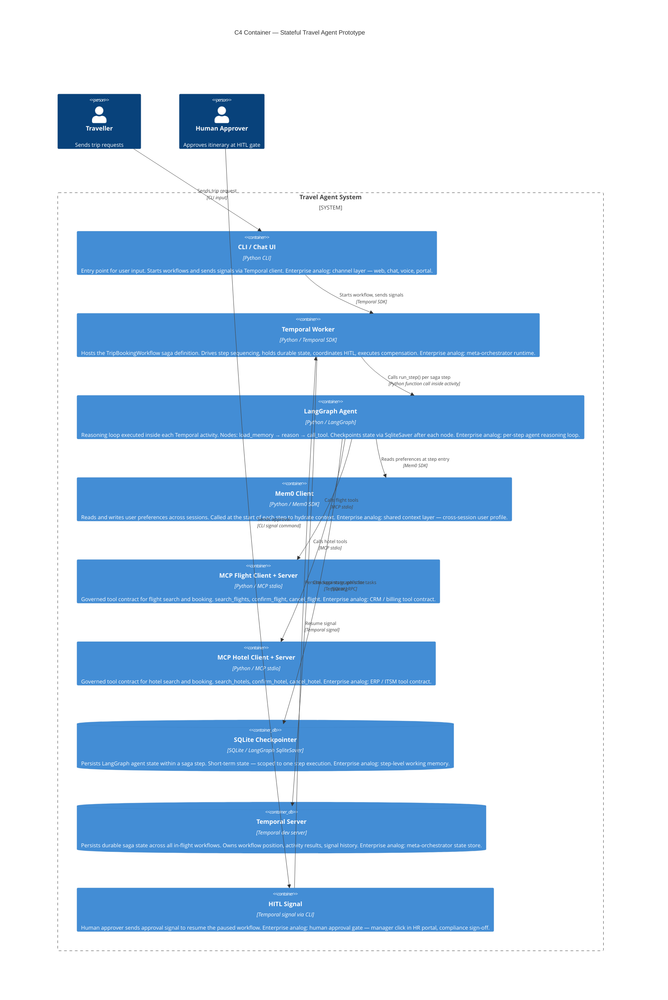

# C4 Container Diagram — Stateful Travel Agent Prototype

Level 2: inside the system boundary. Each container is a deployable unit with a distinct responsibility.

## Enterprise analog

Each container maps to a distinct architectural concern in the enterprise reference architecture. The Temporal Worker is the meta-orchestrator runtime; the LangGraph Agent is the per-step reasoning loop; the MCP Clients are the governed tool contract clients; Mem0 is the shared context layer.

## Diagram

## Container responsibilities

| Container | Owns | Does not own |
|---|---|---|
| Temporal Worker | Saga position, step sequence, compensation | Step-level reasoning, tool selection |
| LangGraph Agent | Reasoning within a step, tool dispatch | Saga position, cross-step state |
| Mem0 Client | Cross-session user preferences | In-step working memory |
| SQLite Checkpointer | In-step graph state | Cross-step saga state |
| Temporal Server | All durable saga state | Reasoning, tool calls |
| MCP Servers | Tool contract interface | Business logic, agent state |

## Key design principle

No container holds state that belongs to another. Temporal owns saga position. LangGraph owns step-level reasoning state. Mem0 owns cross-session preferences. The separation is deliberate — each can be replaced, scaled, or swapped independently.
