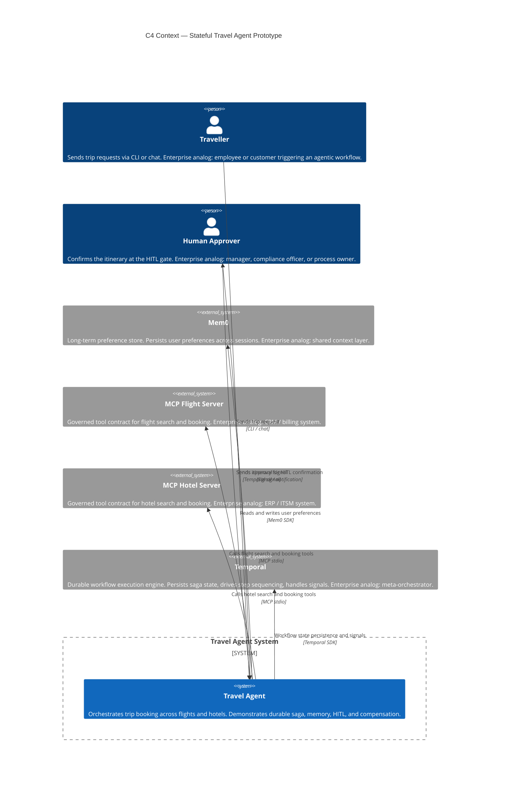

# C4 Context Diagram — Stateful Travel Agent Prototype

Level 1: the system and its external actors. What exists, who uses it, what it depends on.

## Enterprise analog

This diagram maps to the **triggers and external systems** layer of the enterprise architecture. The Traveller is the human prompt trigger; the Human Approver is the HITL gate; Mem0, MCP Servers, and Temporal are the shared substrate components.

## Diagram

## Notes

- All MCP servers are local stubs in the prototype. The interface is real MCP; the backend is deterministic mock data.
- Temporal runs as a local dev server (`temporal server start-dev`) in the prototype. In production this is Temporal Cloud or a self-hosted cluster.
- Mem0 uses an in-process fallback store in the prototype. In production this is Mem0 Cloud or a self-hosted vector DB (Qdrant, Pinecone).
