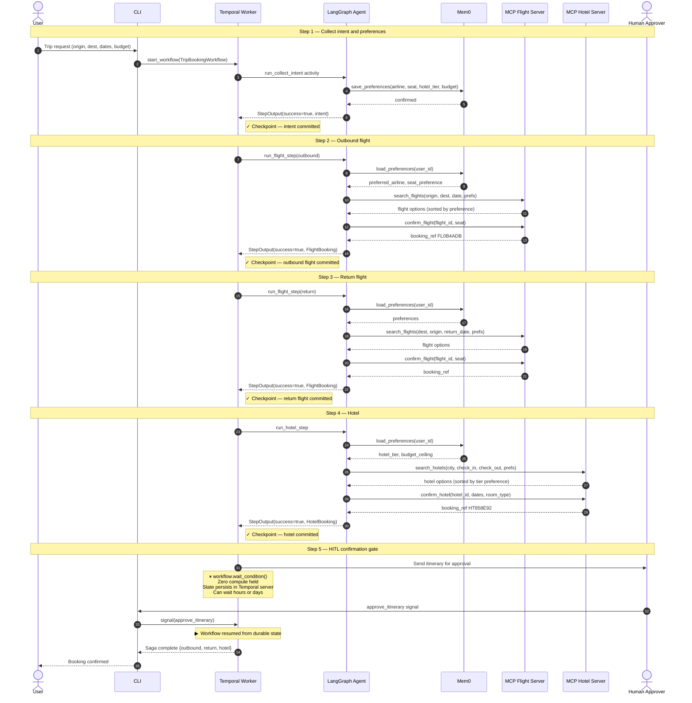
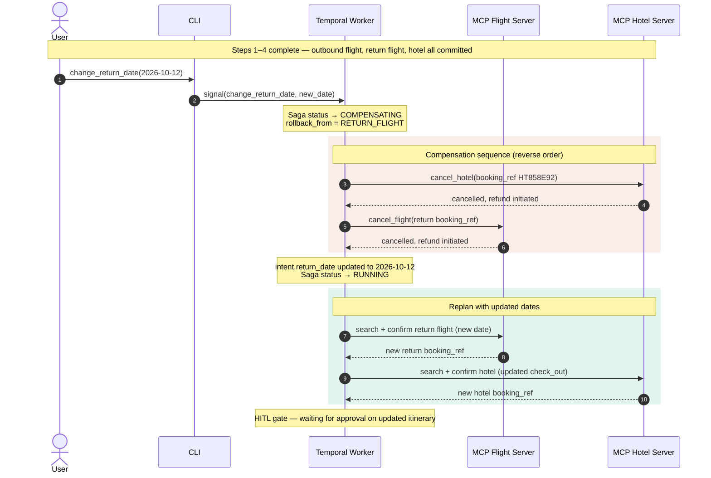
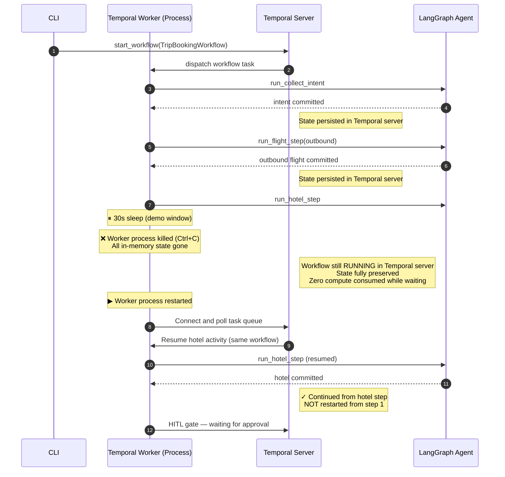

# Workflow Sequence Diagram — Stateful Travel Agent Prototype

Three sequences: happy path, rollback (date change), and crash-resume.

## Happy path — full five-step saga with HITL

---

## Rollback sequence — user changes return date after hotel is confirmed

---

## Crash and resume — durable state across process kill

---

## Notes

**Why durable state matters:** In a conventional workflow engine, killing the worker in the crash-resume sequence would require restarting the entire booking from scratch — re-collecting intent, re-booking the outbound flight, re-booking the return flight. With Temporal, the workflow resumes exactly at the hotel step because every prior step's result is persisted in the Temporal server's database. The worker is stateless; the engine is stateful.

**Why HITL is a durable state, not an interruption:** `workflow.wait_condition()` in Temporal is not a sleep or a poll. It parks the workflow in a persisted waiting state, releases all compute, and resumes the moment the signal arrives — even if that signal comes days later and after multiple worker restarts.

**Why compensation works:** Each forward step registers a compensating action (cancel_hotel, cancel_flight) at definition time. When rollback is triggered, Temporal runs these in inverse order. The prototype demonstrates this with a hotel and flight cancellation; the pattern is identical for reversing a SAP payroll record or closing a ServiceNow IT ticket.
